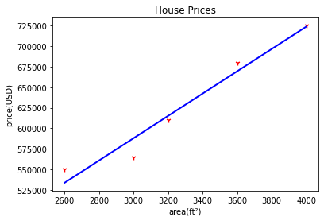
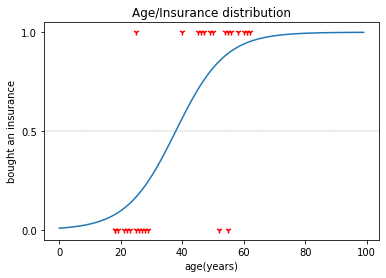
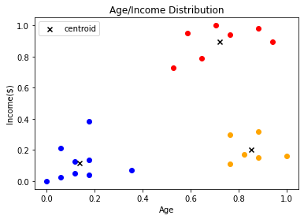
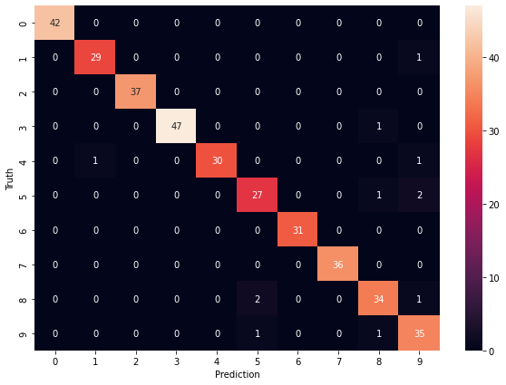

src: [Machine Learning Tutorial Python](https://www.youtube.com/watch?v=gmvvaobm7eQ) by Dhaval Patel

# Machine Learning Fundamentals

A notebook about commonly used machine learning algorithms, containing:

- Univariate Linear Regression
- Multivariate Linear Regression
- Binary & Multiclass Logistic Regression
- Decision Trees
- Support Vector Machines
- Random Forest Classifier
- K-Means Clustering
- Naive Bayes Classifier
- L1, L2 Regularization
- K-Nearest Neigbour Classifier (KNN)

 
 
 
 
